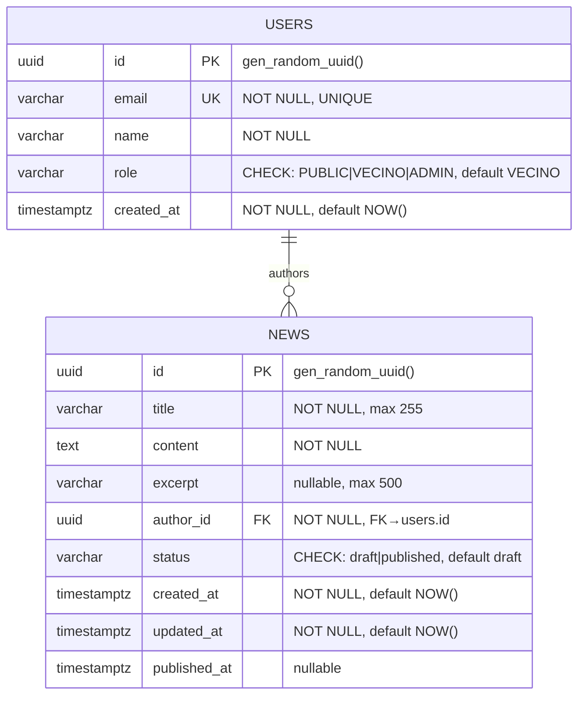

# Data Model

This document describes the database schema for the GAIA application.

## Entity Relationship Diagram

---

## Tables

### users

Stores user accounts for authentication and authorization.

| Column | Type | Constraints | Description |
|--------|------|-------------|-------------|
| `id` | UUID | PK, default `gen_random_uuid()` | Unique identifier |
| `email` | VARCHAR(255) | UNIQUE, NOT NULL | User email (login identifier) |
| `name` | VARCHAR(255) | NOT NULL | Display name |
| `role` | VARCHAR(20) | CHECK: `PUBLIC\|VECINO\|ADMIN`, default `VECINO` | User role for RBAC |
| `created_at` | TIMESTAMPTZ | NOT NULL, default `NOW()` | Account creation timestamp |

**Notes:**
- This is a minimal stub table for the News Management feature FK constraint.
- The full Auth feature will extend this table with password hashes, tokens, etc.

---

### news

Stores news articles with draft/published workflow.

| Column | Type | Constraints | Description |
|--------|------|-------------|-------------|
| `id` | UUID | PK, default `gen_random_uuid()` | Unique identifier |
| `title` | VARCHAR(255) | NOT NULL | News headline |
| `content` | TEXT | NOT NULL | Full article content |
| `excerpt` | VARCHAR(500) | nullable | Auto-generated preview (first 200 chars) |
| `author_id` | UUID | FK → `users.id`, NOT NULL, ON DELETE RESTRICT | Article author |
| `status` | VARCHAR(20) | CHECK: `draft\|published`, default `draft` | Publication status |
| `created_at` | TIMESTAMPTZ | NOT NULL, default `NOW()` | Creation timestamp |
| `updated_at` | TIMESTAMPTZ | NOT NULL, default `NOW()` | Last update timestamp |
| `published_at` | TIMESTAMPTZ | nullable | When article was published |

**Constraints:**
- `ck_news_status`: Ensures status is either `draft` or `published`
- FK to `users.id` with `ON DELETE RESTRICT` prevents orphaned news

---

## Indexes

| Table | Index Name | Columns | Purpose |
|-------|------------|---------|---------|
| `users` | `idx_users_email` | `(email)` UNIQUE | Fast email lookup for login |
| `news` | `idx_news_published_at_desc` | `(published_at DESC NULLS LAST)` | Optimize list queries sorted by date |
| `news` | `idx_news_status` | `(status)` | Optimize filtering by status |
| `news` | `idx_news_author_id` | `(author_id)` | FK lookup optimization |

---

## Migrations

All schema changes are managed via Alembic migrations in `backend/alembic/versions/`:

| Revision | Description | Ticket |
|----------|-------------|--------|
| `20260203_1813_create_users` | Create users table (stub) | NM-PUBLIC-001-DB-T01 |
| `20260203_1814_create_news` | Create news table | NM-PUBLIC-001-DB-T01 |
