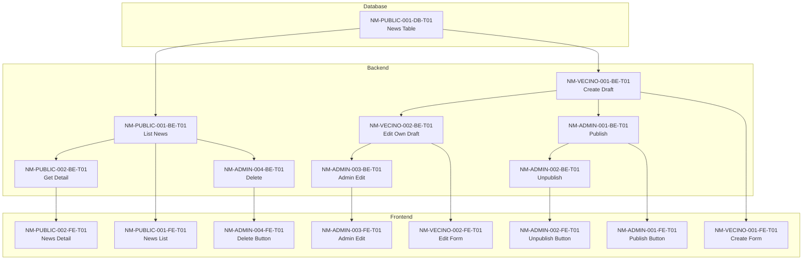

# News Management — Implementation Tickets

## Feature Overview

This document contains all implementation tickets for the **News Management** feature, organized by user story. Each story is broken into **thin vertical slices** (DB → BE → FE) to enable incremental, end-to-end delivery.

### Global Dependencies

- **Prerequisite Feature:** User Authentication & Authorization (JWT-based, RBAC)
- **Database:** PostgreSQL with Alembic migrations
- **Backend:** FastAPI with Hexagonal Architecture (domain/application/infrastructure/presentation)
- **Frontend:** React + Vite + TanStack Query + shadcn/ui

### Roles Reference

| Code | Role | Permissions |
|------|------|-------------|
| `PUBLIC` | Public Visitor | Read published news |
| `VECINO` | Neighbor | Read + Create drafts + Edit own drafts |
| `ADMIN` | Administrator | Full CRUD + Publish/Unpublish |

---

## Story: NM-PUBLIC-001 — View Published News List

**Source:** `user-stories.md`  
**Key Scenarios:** Public visitor views news list, No published news available, Draft articles hidden, Performance budget, Accessibility

### Tickets for NM-PUBLIC-001

1. - [x] **NM-PUBLIC-001-DB-T01 — Create News Table Schema** (2026-02-03)
   - **Type:** DB
   - **Description:** Create the `news` table with all required columns to support the news lifecycle. Supports scenarios: all NM-PUBLIC-001 scenarios (data foundation).
   - **Scope:**
     - **Included:**
       - Table `news` with columns: `id` (UUID PK), `title` (VARCHAR NOT NULL), `content` (TEXT NOT NULL), `excerpt` (VARCHAR), `author_id` (FK to users), `status` (ENUM: draft/published), `created_at`, `updated_at`, `published_at`
       - Index on `published_at DESC` for list queries
       - Index on `id` for detail lookup
       - FK constraint to `users` table (author_id)
     - **Excluded:** Seed data (separate ticket if needed)
   - **Dependencies:** Users table must exist (auth feature)
   - **Deliverables:**
     - Alembic migration script
     - ERD update in `specs/DataModel.md`
     - Rollback script (reversible migration)

---

2. - [x] **NM-PUBLIC-001-BE-T01 — GET /api/v1/news Endpoint (List Published)** (2026-02-04)
   - **Type:** BE
   - **Description:** Implement API endpoint to list published news articles with pagination. Supports scenarios: Public visitor views news list, No published news available, Draft articles hidden, Performance budget.
   - **Scope:**
     - **Included:**
       - `GET /api/v1/news` endpoint (public, no auth required)
       - Query params: `page`, `page_size` (default 10, max 50)
       - Response: paginated list with `id`, `title`, `excerpt`, `author_name`, `published_at`
       - Filter: only `status=published`
       - Sort: `published_at DESC`
       - Empty list returns `{ items: [], total: 0 }`
     - **Excluded:** Search, filtering by category
   - **Dependencies:** NM-PUBLIC-001-DB-T01
   - **Deliverables:**
     - Domain: `News` entity, `NewsRepository` interface
     - Application: `ListPublishedNewsUseCase`
     - Infrastructure: `SQLAlchemyNewsRepository`
     - Presentation: Router, Pydantic schemas (`NewsListResponse`, `NewsListItemDTO`)
     - Unit tests for use case
     - Integration tests for repository
     - API test for endpoint
   - **NFRs:**
     - Performance: P95 < 300ms
     - Observability: Structured logging with `request_id`

---

3. - [x] **NM-PUBLIC-001-FE-T01 — News List Page Component** (2026-02-04)
   - **Type:** FE
   - **Description:** Implement the public news list page with pagination and empty state. Supports scenarios: Public visitor views news list, No published news available, Accessibility.
   - **Scope:**
     - **Included:**
       - Route: `/noticias` (news list page)
       - `useQuery` hook for fetching news list
       - `NewsList` component with card layout
       - Each card shows: title, excerpt, author name, publication date (DD/MM/YYYY)
       - Empty state: "No hay noticias publicadas"
       - Loading skeleton during fetch
       - Pagination controls (next/prev or infinite scroll)
       - Link to detail page for each article
     - **Excluded:** Search bar, category filters
   - **Dependencies:** NM-PUBLIC-001-BE-T01
   - **Deliverables:**
     - `features/news/pages/NewsListPage.tsx`
     - `features/news/components/NewsList.tsx`, `NewsCard.tsx`
     - `features/news/api/newsApi.ts` (query hooks)
     - `features/news/types.ts`
     - Component tests (Vitest + RTL)
   - **NFRs:**
     - A11y: Semantic `<main>` landmark, heading hierarchy (h2/h3), keyboard navigable
     - i18n: UI strings in Spanish (Castilian)

---

## Story: NM-PUBLIC-002 — View News Article Detail

**Source:** `user-stories.md`  
**Key Scenarios:** Public visitor reads published article, Article does not exist, Draft article not accessible to public, Performance budget, Accessibility

### Tickets for NM-PUBLIC-002

1. - [x] **NM-PUBLIC-002-BE-T01 — GET /api/v1/news/{id} Endpoint (Detail)** (2026-02-04)
   - **Type:** BE
   - **Description:** Implement API endpoint to retrieve a single published news article by ID. Supports scenarios: Public visitor reads published article, Article does not exist, Draft article not accessible to public, Performance budget.
   - **Scope:**
     - **Included:**
       - `GET /api/v1/news/{id}` endpoint (public, no auth required)
       - Response: `id`, `title`, `content`, `author_name`, `published_at`
       - Return 404 if article not found OR if `status != published`
       - Security: Draft content MUST NOT be exposed in error response
     - **Excluded:** Related articles, comments
   - **Dependencies:** NM-PUBLIC-001-DB-T01, NM-PUBLIC-001-BE-T01 (reuse domain/repo)
   - **Deliverables:**
     - Application: `GetPublishedNewsDetailUseCase`
     - Presentation: Router extension, `NewsDetailDTO` schema
     - Unit tests for use case (including draft-as-404 case)
     - API test for endpoint
   - **NFRs:**
     - Performance: P95 < 200ms
     - Security: No data leakage for drafts

---

2. - [ ] **NM-PUBLIC-002-FE-T01 — News Detail Page Component**
   - **Type:** FE
   - **Description:** Implement the news article detail page with full content display. Supports scenarios: Public visitor reads published article, Article does not exist, Accessibility.
   - **Scope:**
     - **Included:**
       - Route: `/noticias/:id`
       - `useQuery` hook for fetching article detail
       - Display: title (h1), content (semantic paragraphs), author, publication date
       - Back link to news list
       - 404 error page: "Noticia no encontrada"
       - Loading skeleton
     - **Excluded:** Share buttons, comments section
   - **Dependencies:** NM-PUBLIC-002-BE-T01
   - **Deliverables:**
     - `features/news/pages/NewsDetailPage.tsx`
     - `features/news/components/NewsArticle.tsx`
     - Error boundary for 404 handling
     - Component tests
   - **NFRs:**
     - A11y: Single `<h1>`, semantic HTML, focus management
     - i18n: UI strings in Spanish

---

## Story: NM-VECINO-001 — Create News Draft

**Source:** `user-stories.md`  
**Key Scenarios:** Neighbor creates a news draft, Draft requires title and content, Unauthenticated user cannot create draft, Public visitor cannot access creation form, Draft creation is audited

### Tickets for NM-VECINO-001

1. - [ ] **NM-VECINO-001-BE-T01 — POST /api/v1/news Endpoint (Create Draft)**
   - **Type:** BE
   - **Description:** Implement API endpoint for authenticated Vecinos/Admins to create news drafts. Supports scenarios: Neighbor creates a news draft, Draft requires title and content, Unauthenticated user cannot create draft, Draft creation is audited.
   - **Scope:**
     - **Included:**
       - `POST /api/v1/news` endpoint (requires auth: VECINO or ADMIN)
       - Request body: `title` (required), `content` (required)
       - Auto-set: `status=draft`, `author_id=current_user`, `created_at=now`
       - Generate excerpt from first 200 chars of content
       - Validation errors: 400 with field-specific messages
       - Auth errors: 401 for unauthenticated, 403 for PUBLIC role
       - Audit log: `news.created` event with user_id, news_id, status
     - **Excluded:** Image upload, scheduling
   - **Dependencies:** NM-PUBLIC-001-DB-T01, Auth feature (JWT + RBAC middleware)
   - **Deliverables:**
     - Application: `CreateNewsDraftUseCase`
     - Presentation: Router, `CreateNewsRequest` schema
     - Domain: Audit event interface
     - Infrastructure: Audit logger implementation
     - Unit tests (use case), integration tests (repo), API tests (auth + validation)
   - **NFRs:**
     - Security: RBAC enforcement at API level
     - Observability: Audit log entry created

---

2. - [ ] **NM-VECINO-001-FE-T01 — News Creation Form Page**
   - **Type:** FE
   - **Description:** Implement the news creation form for authenticated neighbors. Supports scenarios: Neighbor creates a news draft, Draft requires title and content, Public visitor cannot access creation form.
   - **Scope:**
     - **Included:**
       - Route: `/noticias/nueva` (protected, requires VECINO or ADMIN)
       - Redirect to login if unauthenticated
       - Form fields: title (required), content textarea (required)
       - Client-side validation with Zod
       - Submit via `useMutation`
       - Success: toast "Noticia guardada como borrador", redirect to list or draft view
       - Error handling: display validation errors
     - **Excluded:** Rich text editor (MVP uses textarea), image upload
   - **Dependencies:** NM-VECINO-001-BE-T01, Auth context
   - **Deliverables:**
     - `features/news/pages/NewsCreatePage.tsx`
     - `features/news/components/NewsForm.tsx`
     - Route guard (auth HOC or loader)
     - Zod schema for form validation
     - Component tests
   - **NFRs:**
     - A11y: Labels above inputs, error announcements
     - i18n: UI strings in Spanish

---

## Story: NM-VECINO-002 — Edit Own Draft

**Source:** `user-stories.md`  
**Key Scenarios:** Neighbor edits their own draft, Neighbor cannot edit another neighbor's draft, Neighbor cannot edit published articles, Draft was deleted

### Tickets for NM-VECINO-002

1. - [ ] **NM-VECINO-002-BE-T01 — PUT /api/v1/news/{id} Endpoint (Edit Own Draft)**
   - **Type:** BE
   - **Description:** Implement API endpoint for Vecinos to edit their own unpublished drafts. Supports scenarios: Neighbor edits their own draft, Neighbor cannot edit another neighbor's draft, Neighbor cannot edit published articles, Draft was deleted.
   - **Scope:**
     - **Included:**
       - `PUT /api/v1/news/{id}` endpoint (requires auth: VECINO or ADMIN)
       - Vecino: can only edit if `author_id == current_user AND status == draft`
       - Admin: can edit any article (delegated to NM-ADMIN-003)
       - Request body: `title`, `content` (at least one required)
       - Validation: 400 for empty required fields
       - 403 if Vecino tries to edit others' drafts or published articles
       - 404 if article not found
       - Update `updated_at` timestamp
     - **Excluded:** Bulk edit
   - **Dependencies:** NM-VECINO-001-BE-T01
   - **Deliverables:**
     - Application: `EditOwnDraftUseCase`
     - Presentation: Router extension, `UpdateNewsRequest` schema
     - Unit tests (ownership + status checks)
     - API tests (403/404 cases)
   - **NFRs:**
     - Security: Ownership validation in use case, not just router

---

2. - [ ] **NM-VECINO-002-FE-T01 — Edit Draft Form Page**
   - **Type:** FE
   - **Description:** Implement the news edit form for neighbors editing their own drafts. Supports scenarios: Neighbor edits their own draft, Neighbor cannot edit published articles.
   - **Scope:**
     - **Included:**
       - Route: `/noticias/:id/editar` (protected)
       - Fetch existing draft data with `useQuery`
       - Pre-populate form with current values
       - Submit via `useMutation`
       - Success: toast "Cambios guardados"
       - Handle 403: redirect with message "Solo los administradores pueden editar noticias publicadas"
       - Handle 404: show "Noticia no encontrada"
     - **Excluded:** Version history
   - **Dependencies:** NM-VECINO-002-BE-T01, NM-VECINO-001-FE-T01 (reuse NewsForm)
   - **Deliverables:**
     - `features/news/pages/NewsEditPage.tsx`
     - Reuse `NewsForm.tsx` in edit mode
     - Error handling for 403/404
     - Component tests
   - **NFRs:**
     - A11y: Focus management on load
     - i18n: Error messages in Spanish

---

## Story: NM-ADMIN-001 — Publish News Article

**Source:** `user-stories.md`  
**Key Scenarios:** Admin publishes a draft, Vecino cannot publish articles, Unauthenticated user cannot publish, Article is already published, Publication is audited

### Tickets for NM-ADMIN-001

1. - [ ] **NM-ADMIN-001-BE-T01 — POST /api/v1/news/{id}/publish Endpoint**
   - **Type:** BE
   - **Description:** Implement API endpoint for Admins to publish a draft article. Supports scenarios: Admin publishes a draft, Vecino cannot publish articles, Unauthenticated user cannot publish, Article is already published, Publication is audited.
   - **Scope:**
     - **Included:**
       - `POST /api/v1/news/{id}/publish` endpoint (requires auth: ADMIN only)
       - Change `status` to `published`, set `published_at=now`
       - 403 for non-admin roles
       - 401 for unauthenticated
       - 400 if already published: "La noticia ya está publicada"
       - 404 if article not found
       - Audit log: `news.published` event
     - **Excluded:** Scheduled publishing
   - **Dependencies:** NM-VECINO-001-BE-T01
   - **Deliverables:**
     - Application: `PublishNewsUseCase`
     - Presentation: Router, response schema
     - Audit log entry
     - Unit tests, API tests (RBAC + edge cases)
   - **NFRs:**
     - Security: Admin-only RBAC
     - Observability: Audit log

---

2. - [ ] **NM-ADMIN-001-FE-T01 — Publish Button in Admin News View**
   - **Type:** FE
   - **Description:** Implement the publish action button for admins in the news management view. Supports scenarios: Admin publishes a draft, Article is already published.
   - **Scope:**
     - **Included:**
       - Admin news list/detail view with "Publicar" button (visible only for drafts)
       - `useMutation` for publish action
       - Success: toast "Noticia publicada", update UI state
       - Handle 400 (already published): toast with message
       - Button disabled/hidden for already-published articles
     - **Excluded:** Bulk publish
   - **Dependencies:** NM-ADMIN-001-BE-T01, Admin news list (requires admin panel scaffold)
   - **Deliverables:**
     - `features/news/components/PublishButton.tsx`
     - Integration in admin news list/detail
     - Component tests
   - **NFRs:**
     - A11y: Button accessible, loading state announced

---

## Story: NM-ADMIN-002 — Unpublish News Article

**Source:** `user-stories.md`  
**Key Scenarios:** Admin unpublishes an article, Vecino cannot unpublish articles, Article is already a draft, Unpublication is audited

### Tickets for NM-ADMIN-002

1. - [ ] **NM-ADMIN-002-BE-T01 — POST /api/v1/news/{id}/unpublish Endpoint**
   - **Type:** BE
   - **Description:** Implement API endpoint for Admins to unpublish a published article. Supports scenarios: Admin unpublishes an article, Vecino cannot unpublish articles, Article is already a draft, Unpublication is audited.
   - **Scope:**
     - **Included:**
       - `POST /api/v1/news/{id}/unpublish` endpoint (requires auth: ADMIN only)
       - Change `status` to `draft`, clear `published_at`
       - 403 for non-admin roles
       - 400 if already draft: "La noticia ya es un borrador"
       - 404 if article not found
       - Audit log: `news.unpublished` event
     - **Excluded:** Reason tracking
   - **Dependencies:** NM-ADMIN-001-BE-T01
   - **Deliverables:**
     - Application: `UnpublishNewsUseCase`
     - Presentation: Router extension
     - Audit log entry
     - Unit tests, API tests
   - **NFRs:**
     - Security: Admin-only RBAC
     - Observability: Audit log

---

2. - [ ] **NM-ADMIN-002-FE-T01 — Unpublish Button in Admin News View**
   - **Type:** FE
   - **Description:** Implement the unpublish action button for admins. Supports scenarios: Admin unpublishes an article, Article is already a draft.
   - **Scope:**
     - **Included:**
       - "Despublicar" button (visible only for published articles)
       - `useMutation` for unpublish action
       - Success: toast "Noticia despublicada", update UI state
       - Handle 400 (already draft): toast with message
     - **Excluded:** Confirmation dialog (optional enhancement)
   - **Dependencies:** NM-ADMIN-002-BE-T01
   - **Deliverables:**
     - `features/news/components/UnpublishButton.tsx`
     - Integration in admin news list/detail
     - Component tests

---

## Story: NM-ADMIN-003 — Edit Any News Article

**Source:** `user-stories.md`  
**Key Scenarios:** Admin edits a published article, Admin edits a neighbor's draft, Vecino cannot edit published articles, Cannot save with empty required fields, Edit is audited

### Tickets for NM-ADMIN-003

1. - [ ] **NM-ADMIN-003-BE-T01 — PUT /api/v1/news/{id} Endpoint (Admin Edit Any)**
   - **Type:** BE
   - **Description:** Extend the edit endpoint to allow Admins to edit any article regardless of ownership or status. Supports scenarios: Admin edits a published article, Admin edits a neighbor's draft, Edit is audited.
   - **Scope:**
     - **Included:**
       - Extend `PUT /api/v1/news/{id}` to allow ADMIN role to edit any article
       - Validation: 400 for empty required fields
       - Update `updated_at` timestamp
       - Audit log: `news.updated` event
     - **Excluded:** Version history
   - **Dependencies:** NM-VECINO-002-BE-T01 (extend existing endpoint)
   - **Deliverables:**
     - Application: Extend `EditNewsUseCase` with admin path
     - Unit tests (admin can edit any)
     - API tests
   - **NFRs:**
     - Security: RBAC (Admin bypass ownership check)
     - Observability: Audit log

---

2. - [ ] **NM-ADMIN-003-FE-T01 — Admin Edit Any Article Page**
   - **Type:** FE
   - **Description:** Enable admins to access the edit form for any article. Supports scenarios: Admin edits a published article, Admin edits a neighbor's draft.
   - **Scope:**
     - **Included:**
       - Admins can navigate to `/noticias/:id/editar` for any article
       - Reuse `NewsEditPage` with admin permission check
       - Success: toast "Cambios guardados"
       - Changes immediately visible if article is published
     - **Excluded:** Inline editing in list view
   - **Dependencies:** NM-ADMIN-003-BE-T01, NM-VECINO-002-FE-T01
   - **Deliverables:**
     - Permission logic in `NewsEditPage` (allow admin for any)
     - Component tests for admin path

---

## Story: NM-ADMIN-004 — Delete News Article

**Source:** `user-stories.md`  
**Key Scenarios:** Admin deletes an article, Vecino cannot delete articles, Deletion requires confirmation, Article does not exist, Deletion is audited

### Tickets for NM-ADMIN-004

1. - [ ] **NM-ADMIN-004-BE-T01 — DELETE /api/v1/news/{id} Endpoint**
   - **Type:** BE
   - **Description:** Implement API endpoint for Admins to delete a news article permanently. Supports scenarios: Admin deletes an article, Vecino cannot delete articles, Article does not exist, Deletion is audited.
   - **Scope:**
     - **Included:**
       - `DELETE /api/v1/news/{id}` endpoint (requires auth: ADMIN only)
       - Hard delete from database
       - 403 for non-admin roles
       - 404 if article not found
       - Audit log: `news.deleted` event with article metadata snapshot
     - **Excluded:** Soft delete, trash/restore
   - **Dependencies:** NM-PUBLIC-001-DB-T01
   - **Deliverables:**
     - Application: `DeleteNewsUseCase`
     - Presentation: Router extension
     - Audit log with metadata
     - Unit tests, API tests
   - **NFRs:**
     - Security: Admin-only RBAC
     - Observability: Audit log with deleted content metadata

---

2. - [ ] **NM-ADMIN-004-FE-T01 — Delete Button with Confirmation Dialog**
   - **Type:** FE
   - **Description:** Implement the delete action with confirmation dialog for admins. Supports scenarios: Admin deletes an article, Deletion requires confirmation.
   - **Scope:**
     - **Included:**
       - "Eliminar" button (destructive variant) in admin news view
       - Confirmation dialog: "¿Seguro que desea eliminar esta noticia?"
       - `useMutation` for delete action
       - Success: toast "Noticia eliminada", remove from list / redirect
       - Handle 404: toast "Noticia no encontrada"
     - **Excluded:** Bulk delete, undo
   - **Dependencies:** NM-ADMIN-004-BE-T01
   - **Deliverables:**
     - `features/news/components/DeleteButton.tsx`
     - `AlertDialog` for confirmation (shadcn)
     - Integration in admin news list/detail
     - Component tests
   - **NFRs:**
     - A11y: Dialog trap focus, Escape to cancel
     - UX: Destructive visual styling

---

## Ticket Summary

| Story ID | Ticket ID | Type | Title | Priority |
|----------|-----------|------|-------|----------|
| NM-PUBLIC-001 | NM-PUBLIC-001-DB-T01 | DB | Create News Table Schema | Must |
| NM-PUBLIC-001 | NM-PUBLIC-001-BE-T01 | BE | GET /api/v1/news Endpoint (List Published) | Must |
| NM-PUBLIC-001 | NM-PUBLIC-001-FE-T01 | FE | News List Page Component | Must |
| NM-PUBLIC-002 | NM-PUBLIC-002-BE-T01 | BE | GET /api/v1/news/{id} Endpoint (Detail) | Must |
| NM-PUBLIC-002 | NM-PUBLIC-002-FE-T01 | FE | News Detail Page Component | Must |
| NM-VECINO-001 | NM-VECINO-001-BE-T01 | BE | POST /api/v1/news Endpoint (Create Draft) | Must |
| NM-VECINO-001 | NM-VECINO-001-FE-T01 | FE | News Creation Form Page | Must |
| NM-VECINO-002 | NM-VECINO-002-BE-T01 | BE | PUT /api/v1/news/{id} Endpoint (Edit Own Draft) | Should |
| NM-VECINO-002 | NM-VECINO-002-FE-T01 | FE | Edit Draft Form Page | Should |
| NM-ADMIN-001 | NM-ADMIN-001-BE-T01 | BE | POST /api/v1/news/{id}/publish Endpoint | Must |
| NM-ADMIN-001 | NM-ADMIN-001-FE-T01 | FE | Publish Button in Admin News View | Must |
| NM-ADMIN-002 | NM-ADMIN-002-BE-T01 | BE | POST /api/v1/news/{id}/unpublish Endpoint | Should |
| NM-ADMIN-002 | NM-ADMIN-002-FE-T01 | FE | Unpublish Button in Admin News View | Should |
| NM-ADMIN-003 | NM-ADMIN-003-BE-T01 | BE | PUT /api/v1/news/{id} Endpoint (Admin Edit Any) | Should |
| NM-ADMIN-003 | NM-ADMIN-003-FE-T01 | FE | Admin Edit Any Article Page | Should |
| NM-ADMIN-004 | NM-ADMIN-004-BE-T01 | BE | DELETE /api/v1/news/{id} Endpoint | Should |
| NM-ADMIN-004 | NM-ADMIN-004-FE-T01 | FE | Delete Button with Confirmation Dialog | Should |

---

## Dependency Graph

---

## Implementation Order (Recommended)

### Phase 1: Foundation (Must Have - MVP Core)
1. `NM-PUBLIC-001-DB-T01` — Database schema
2. `NM-PUBLIC-001-BE-T01` → `NM-PUBLIC-001-FE-T01` — Public list view
3. `NM-PUBLIC-002-BE-T01` → `NM-PUBLIC-002-FE-T01` — Public detail view
4. `NM-VECINO-001-BE-T01` → `NM-VECINO-001-FE-T01` — Draft creation
5. `NM-ADMIN-001-BE-T01` → `NM-ADMIN-001-FE-T01` — Publishing

### Phase 2: Complete CRUD (Should Have)
6. `NM-VECINO-002-BE-T01` → `NM-VECINO-002-FE-T01` — Edit own draft
7. `NM-ADMIN-002-BE-T01` → `NM-ADMIN-002-FE-T01` — Unpublish
8. `NM-ADMIN-003-BE-T01` → `NM-ADMIN-003-FE-T01` — Admin edit any
9. `NM-ADMIN-004-BE-T01` → `NM-ADMIN-004-FE-T01` — Delete
